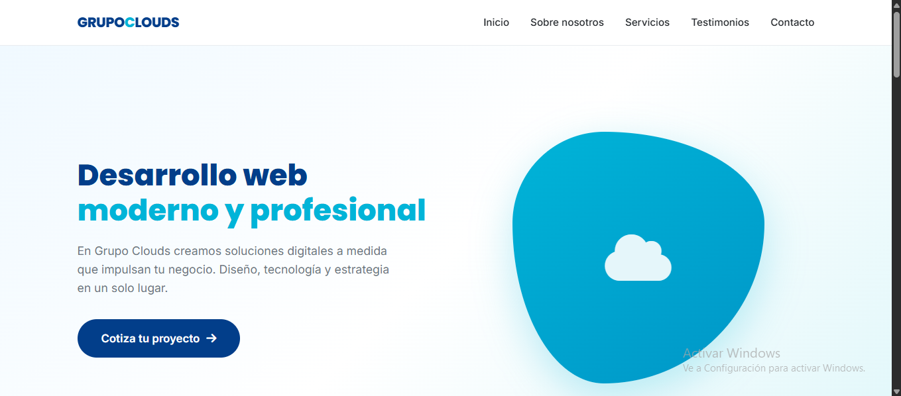
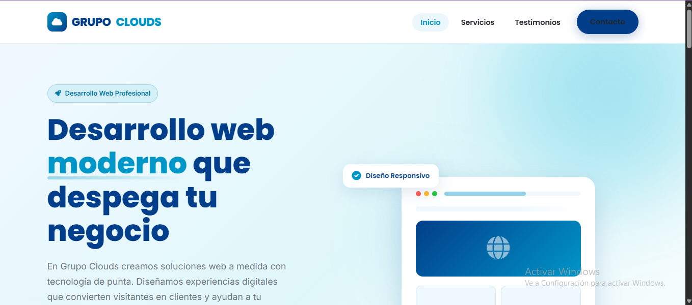

# PFO2 - Prompt Engineering en Agentes de IA

## Datos del estudiante
- Nombre: Eduardo M Moreno
- Comisión: LUNES
- Fecha de entrega: 26/6/2026

## Link al deploy unificado
[URL de Vercel o Netlify - COMPLETAR DESPUÉS DEL DEPLOY]

## Prompt exacto utilizado
```
Rol: Actúa como un experto desarrollador front-end especializado en diseño de alta conversión, SEO semántico y accesibilidad (WCAG 2.1).

Contexto y Objetivo:
Necesito que generes el código HTML, CSS y JavaScript completo para una Landing Page moderna, 100% responsive y profesional. La página es para una empresa llamada "Grupo Clouds", que brinda servicios de desarrollo web moderno y profesional.

Datos de marca (úsalos obligatoriamente):
- Nombre de la empresa: Grupo Clouds
- Eslogan (opcional, puedes inventar uno): Ejemplo: "Desarrollo web que despega tu negocio"
- Paleta de colores (inspirada en un logo celeste y blanco):
  * Color primario: Celeste (#00B4D8) o (#0096C7) - elige el que mejor contraste
  * Color secundario: Azul profundo (#023E8A) - para acentos y botones
  * Fondo general: Blanco (#FFFFFF)
  * Fondo de secciones alternas: Celeste muy claro (#E0F7FA) o (#F0F9FF)
  * Texto principal: Gris oscuro (#212529)
  * Texto secundario: Gris (#6C757D)
- Tipografía: 'Poppins' para títulos y 'Inter' o 'Open Sans' para textos. Usa Google Fonts.
- Tono: Profesional, confiable, tecnológico, limpio y moderno.

Estructura obligatoria (en este orden lógico):

1. Header (Sticky):
   - Logo: Texto "GRUPO CLOUDS" en negrita, color primario o azul profundo.
   - Menú de navegación: Inicio, Servicios, Testimonios, Contacto.
   - En móvil (<768px): Menú hamburguesa (☰) que se despliega verticalmente con JS. Debe cerrarse al hacer clic en un enlace.
   - Scroll suave al hacer clic en cualquier enlace del menú.

2. Hero Section:
   - Título H1 impactante: Ejemplo: "Desarrollo web moderno y profesional" (o similar, relacionado con Grupo Clouds).
   - Texto de soporte (párrafo): Explicar que son expertos en crear soluciones web a medida.
   - Botón CTA llamativo: "Cotiza tu proyecto →" con color de acento (azul profundo o celeste).
   - Fondo degradado sutil o una forma geométrica de fondo.

3. Sobre Nosotros / Descripción:
   - Texto de mínimo 50 palabras explicando qué hace Grupo Clouds (desarrollo web profesional, sitios modernos, optimización, etc.).
   - Destacar confianza, experiencia y enfoque en resultados.
   - Puedes incluir un mini dato como "+50 proyectos entregados" o algo similar.

4. Sección de Servicios:
   - 3 tarjetas (cards) en grid (3 en desktop, 1 en móvil).
   - Cada tarjeta debe tener:
     * Ícono: Usar FontAwesome 6 (CDN incluido en <head>). Iconos sugeridos: 🌐 (globe), ⚡ (rocket), 🛡️ (shield).
     * Título: "Desarrollo Web a Medida", "Optimización y Rendimiento", "Soporte y Mantenimiento" (o variantes similares).
     * Descripción corta (15-20 palabras).
     * Efecto hover: elevación (sombra más grande) y borde sutil.
   - Fondo de esta sección: Celeste muy claro (#F0F9FF).

5. Testimonios:
   - 2 reseñas de clientes (en grid, lado a lado en desktop).
   - Cada testimonio debe incluir:
     * Foto de perfil: Placeholder circular con iniciales (ej: "MC" o usar UI Faces).
     * Nombre y cargo (ej: "Laura Méndez, CTO de Empresa X").
     * Calificación: 5 estrellas (⭐ con HTML/CSS o FontAwesome).
     * Texto del testimonio (30-50 palabras, positivo, relacionado con desarrollo web).
   - Las tarjetas deben tener borde redondeado (border-radius: 20px) y sombra suave.

6. Formulario de Contacto (solo UI, sin backend real):
   - Campos: Nombre completo, Correo electrónico, Mensaje.
   - Botón de envío con color de acento.
   - Al hacer clic en "Enviar", mostrar un alert() de JavaScript: "¡Gracias [Nombre]! Nos pondremos en contacto contigo pronto (demo)."
   - Estilos :focus con borde celeste (#00B4D8).
   - Placeholders amigables.

7. Footer:
   - Logo o nombre "Grupo Clouds" + descripción corta.
   - Enlaces a redes sociales: Íconos de Facebook, Instagram, LinkedIn, Twitter (usar FontAwesome con href="#").
   - Copyright dinámico con el año actual (JavaScript).
   - NO incluir política de privacidad ni enlaces legales.
   - Fondo gris muy claro o azul profundo (elige el que mejor contraste con blanco).

Requisitos técnicos obligatorios:
- Responsividad total: Flexbox y CSS Grid. Desktop (>1024px), tablet (768px-1024px), móvil (<768px).
- HTML semántico: <header>, <main>, <section>, <footer>.
- CSS interno o en <style>, JavaScript interno al final del body.
- Accesibilidad: Atributos alt en imágenes, aria-label en íconos de redes sociales, contraste suficiente (texto oscuro sobre fondo claro).
- Animaciones suaves: Hover en botones y tarjetas. Opcional: fade-in suave al hacer scroll (puede ser simple, no obligatorio).
- Fuentes: Google Fonts (Poppins + Inter) con display=swap.
- Incluir CDN de FontAwesome 6 (https://cdnjs.cloudflare.com/ajax/libs/font-awesome/6.0.0-beta3/css/all.min.css).
```

## Capturas de pantalla
### Landing Page - Agente 1 (OpenCode + DeepSeek)


### Landing Page - Agente 2 (Antigravity + Claude)


## Comparativa y conclusiones
Claramente visualmente es mejor el modelo de Cloude respecto al de Deepseek.
- El modelo de Deepseek tiene un diseño más básico, con menos atención a los detalles visuales y una estructura más simple. La tipografía es menos atractiva y la disposición de los elementos es más genérica.
- En contraste, el modelo de Claude presenta un diseño más moderno y profesional, con una mejor jerarquía visual, tipografía cuidada y un uso más refinado del espacio. Los bordes, sombras y espaciado generan una sensación de mayor pulido y usabilidad. Además, Claude logra integrar mejor los elementos gráficos (como iconos o ilustraciones) sin saturar la interfaz.
- **Conclusiones:**
Si bien Deepseek cumple con la funcionalidad básica y puede ser suficiente para entornos técnicos o prototipos rápidos, Claude destaca claramente en términos de experiencia de usuario y atractivo visual. Para proyectos donde la presentación frontal y la percepción de calidad son clave, la elección sería Claude. En cambio, Deepseek podría preferirse en contextos donde se priorice la simplicidad extrema, el rendimiento puro o restricciones de recursos.

## Estructura del repositorio
- `index.html` - Portada principal con accesos
- `landing-opencode.html` - Landing generada por OpenCode + DeepSeek
- `landing-antigravity.html` - Landing generada por Antigravity + Claude
- `img/` - Carpeta con las capturas de pantalla
- `README.md` - Este archivo
